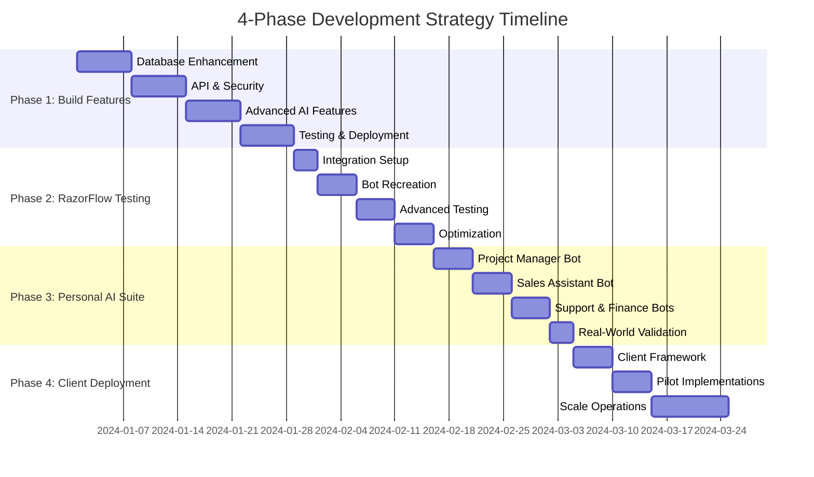

# 📋 **COMPREHENSIVE PROJECT MANAGEMENT DASHBOARD**

## Complete Execution Tracking for All 4 Phases

> **Project Goal**: Transform from development to battle-tested client-ready platform
> **Timeline**: 12-16 weeks | **Status**: Ready to Execute | **Last Updated**: ****\_\_\_****

---

# 🎯 **EXECUTIVE SUMMARY**

## **Business Vision**

- Build features in Pixel-AI-Creator ⏳ **Phase 1** (3-4 weeks)
- Test with RazorFlow as primary test user ⏳ **Phase 2** (2-3 weeks)
- Validate with personal AI assistant suite ⏳ **Phase 3** (2-3 weeks)
- Deploy battle-tested platform to clients ⏳ **Phase 4** (2-4 weeks ongoing)

## **Strategic Foundation** 🤖

**RazorFlow AI Pipeline Integration**: Our strategy now leverages RazorFlow's proven 5-stage AI Development Pipeline:

- **Stage 01-02**: Analysis & Development (Phase 1 enhancement)
- **Stage 03**: Integration & Testing (Phase 2 direct application)
- **Stage 04-05**: Deployment & Optimization (Phase 3-4 framework)
- **Success Metrics**: 156+ projects, 99.2% satisfaction, 99.9% uptime

## **Current Status Dashboard**

| Phase       | Duration  | Progress | Key Deliverables              | Status         |
| ----------- | --------- | -------- | ----------------------------- | -------------- |
| **Phase 1** | 3-4 weeks | ⚪ 0%    | Enhanced Platform Features    | 🔴 Not Started |
| **Phase 2** | 2-3 weeks | ⚪ 0%    | RazorFlow Integration Testing | 🔴 Not Started |
| **Phase 3** | 2-3 weeks | ⚪ 0%    | Personal AI Assistant Suite   | 🔴 Not Started |
| **Phase 4** | 2-4 weeks | ⚪ 0%    | Client Deployment Framework   | 🔴 Not Started |

---

# 📅 **MASTER PROJECT TIMELINE**



---

# 📊 **PROGRESS TRACKING MATRICES**

## **Phase 1: Build Features Progress Matrix**

| Week       | Focus Area          | Tasks Completed | Success Rate | Blockers   | Next Actions     |
| ---------- | ------------------- | --------------- | ------------ | ---------- | ---------------- |
| **Week 1** | Database & API      | \_\_\_/8 tasks  | \_\_%        | ****\_**** | ****\_\_\_\_**** |
| **Week 2** | Security & Features | \_\_\_/8 tasks  | \_\_%        | ****\_**** | ****\_\_\_\_**** |
| **Week 3** | AI & Integration    | \_\_\_/8 tasks  | \_\_%        | ****\_**** | ****\_\_\_\_**** |

## **Phase 2: RazorFlow Testing Progress Matrix**

| Week       | Testing Focus     | Bots Tested      | Performance           | Issues Found    | Resolution Status  |
| ---------- | ----------------- | ---------------- | --------------------- | --------------- | ------------------ |
| **Week 4** | Basic Integration | \_\_\_/3 bots    | \_\_\_\_ms avg        | \_\_\_ critical | \_\_\_\_% resolved |
| **Week 5** | Advanced Features | \_\_\_/5 areas   | \_\_\_\_% success     | \_\_\_ medium   | \_\_\_\_% resolved |
| **Week 6** | Optimization      | \_\_\_/5 metrics | \_\_\_\_% improvement | \_\_\_ minor    | \_\_\_\_% resolved |

## **Phase 3: Personal AI Suite Progress Matrix**

| Week       | Assistant Type  | Features Built     | Business Impact | Automation Level  | ROI Metrics      |
| ---------- | --------------- | ------------------ | --------------- | ----------------- | ---------------- |
| **Week 7** | Project Manager | \_\_\_/6 features  | $**\_\_**/month | \_\_\_% automated | \_\_\_\_% profit |
| **Week 8** | Sales & Support | \_\_\_/8 features  | $**\_\_**/month | \_\_\_% automated | \_\_\_\_% profit |
| **Week 9** | Real-World Test | \_\_\_/5 scenarios | $**\_\_**/month | \_\_\_% automated | \_\_\_\_% profit |

## **Phase 4: Client Deployment Progress Matrix**

| Week         | Client Activity  | Clients Onboarded | Revenue Generated | Satisfaction | Retention |
| ------------ | ---------------- | ----------------- | ----------------- | ------------ | --------- |
| **Week 10**  | Framework Build  | \_\_\_/3 systems  | $**\_\_\_**       | \_\_\_\_%    | \_\_\_\_% |
| **Week 11**  | Pilot Clients    | \_\_\_/3 clients  | $**\_\_\_**       | \_\_\_\_%    | \_\_\_\_% |
| **Week 12+** | Scale Operations | \_\_\_/10 clients | $**\_\_\_**       | \_\_\_\_%    | \_\_\_\_% |

---

# 🎯 **DAILY EXECUTION TRACKER**

## **Current Day Execution**

> **Date**: ****\_**** | **Phase**: **_ | **Week**: _** | **Day**: \_\_\_

### **Today's Objectives** ⏰ **Target: 8 hours**

- [ ] **Task 1**: ************\_************ | **Time**: \_\_\_ hours | **Status**: ⚪
- [ ] **Task 2**: ************\_************ | **Time**: \_\_\_ hours | **Status**: ⚪
- [ ] **Task 3**: ************\_************ | **Time**: \_\_\_ hours | **Status**: ⚪
- [ ] **Task 4**: ************\_************ | **Time**: \_\_\_ hours | **Status**: ⚪

### **Today's Blockers & Solutions**

| Blocker    | Impact   | Solution     | ETA    |
| ---------- | -------- | ------------ | ------ |
| **\_\_\_** | **\_\_** | **\_\_\_\_** | \_\_\_ |

### **Today's Key Decisions**

- **Decision 1**: ****************\_****************
- **Decision 2**: ****************\_****************
- **Decision 3**: ****************\_****************

### **End of Day Review**

- **Hours Worked**: \_\_\_ / 8 hours
- **Tasks Completed**: **_ / _** tasks
- **Blockers Resolved**: **_ / _** blockers
- **Tomorrow's Priority**: ************\_************

---

# 📈 **KEY PERFORMANCE INDICATORS**

## **Technical Performance Metrics**

```python
# Real-time monitoring dashboard
Platform_Performance = {
    "response_time": "___ms (target: <200ms)",
    "uptime": "___% (target: 99.9%)",
    "concurrent_users": "___ (target: 1000+)",
    "error_rate": "___% (target: <0.1%)",
    "api_calls_per_second": "___ (target: 100+)"
}

Database_Performance = {
    "query_response_time": "___ms (target: <50ms)",
    "connection_pool_usage": "___% (target: <80%)",
    "storage_usage": "___GB (monitoring)",
    "backup_success_rate": "___% (target: 100%)"
}
```

## **Business Performance Metrics**

```python
Business_KPIs = {
    "client_acquisition_rate": "___ clients/month",
    "revenue_per_client": "$___/month",
    "client_satisfaction": "___% (target: >95%)",
    "churn_rate": "___% (target: <5%)",
    "profit_margin": "___% (target: >70%)"
}

Automation_Metrics = {
    "task_automation_level": "___% (target: >90%)",
    "manual_intervention_needed": "___/day (target: <5)",
    "passive_income_ratio": "___% (target: >80%)",
    "time_saved_per_day": "___ hours"
}
```

---

# 🚨 **RISK MANAGEMENT & CONTINGENCY**

## **Risk Assessment Matrix**

| Risk Category      | Probability | Impact | Mitigation Strategy      | Contingency Plan              |
| ------------------ | ----------- | ------ | ------------------------ | ----------------------------- |
| **Technical Debt** | Medium      | High   | Regular code reviews     | Dedicated refactoring sprints |
| **Client Churn**   | Low         | High   | Proactive communication  | Quick issue resolution        |
| **Scaling Issues** | Medium      | Medium | Load testing             | Auto-scaling infrastructure   |
| **Competition**    | High        | Medium | Unique value proposition | Rapid feature development     |
| **Team Burnout**   | Medium      | High   | Realistic timelines      | Resource allocation           |

## **Emergency Response Procedures**

### **Critical System Failure**

1. **Immediate**: Switch to backup systems
2. **Within 1 hour**: Identify root cause
3. **Within 4 hours**: Implement temporary fix
4. **Within 24 hours**: Deploy permanent solution
5. **Within 48 hours**: Post-mortem analysis

### **Client Escalation**

1. **Immediate**: Acknowledge issue
2. **Within 2 hours**: Provide status update
3. **Within 8 hours**: Implement solution
4. **Within 24 hours**: Follow-up and validation
5. **Within 72 hours**: Process improvement

---

# 📚 **RESOURCE LIBRARY**

## **Quick Reference Documents**

- [ ] 📋 [PHASE_1_EXECUTION_CHECKLIST.md](./PHASE_1_EXECUTION_CHECKLIST.md)
- [ ] 📋 [PHASE_2-4_EXECUTION_CHECKLISTS.md](./PHASE_2-4_EXECUTION_CHECKLISTS.md)
- [ ] 🗺️ [4_PHASE_DEVELOPMENT_ROADMAP.md](./4_PHASE_DEVELOPMENT_ROADMAP.md)
- [ ] 🚀 [STAGING_DEPLOYMENT_PLAN.md](./STAGING_DEPLOYMENT_PLAN.md)
- [ ] ⚡ [IMMEDIATE_ACTION_PLAN.md](./IMMEDIATE_ACTION_PLAN.md)
- [ ] 🤖 [RAZORFLOW_PIPELINE_ANALYSIS.md](./RAZORFLOW_PIPELINE_ANALYSIS.md)

## **Automation Scripts**

- [ ] 🔧 [deploy/deploy-master.sh](./deploy/deploy-master.sh)
- [ ] 🐋 [deploy/scripts/docker-health-check.sh](./deploy/scripts/docker-health-check.sh)
- [ ] ⚙️ [deploy/scripts/monitoring-setup.sh](./deploy/scripts/monitoring-setup.sh)

## **Configuration Files**

- [ ] 🏗️ [deploy/pixel-ai/railway.json](./deploy/pixel-ai/railway.json)
- [ ] 🏗️ [deploy/razorflow/railway.json](./deploy/razorflow/railway.json)
- [ ] 🐳 [docker-compose.staging.yml](./docker-compose.staging.yml)

---

# 🎯 **WEEKLY SPRINT PLANNING**

## **Weekly Review Template**

### **Week \_\_\_ Review** (Date: **\_\_\_**)

- **Planned vs Actual**: \_\_\_% completion rate
- **Key Achievements**:
  1. ***
  2. ***
  3. ***
- **Blockers Encountered**:
  1. ***
  2. ***
- **Lessons Learned**:
  1. ***
  2. ***
- **Next Week Priority**: ******\_\_\_******

## **Sprint Goals Setting**

### **Next Week Objectives** (Week \_\_\_):

- **Primary Goal**: ********\_\_\_\_********
- **Secondary Goals**:
  1. ***
  2. ***
  3. ***
- **Success Criteria**: ******\_\_\_\_******
- **Resource Requirements**: ****\_\_\_****

---

# 🔄 **CONTINUOUS IMPROVEMENT FRAMEWORK**

## **Monthly Business Review Agenda**

1. **Financial Performance Analysis**

   - Revenue vs targets
   - Cost optimization opportunities
   - Profit margin analysis
   - Cash flow projections

2. **Technical Performance Review**

   - System reliability metrics
   - Performance optimization results
   - Security audit findings
   - Scalability improvements

3. **Client Success Analysis**

   - Satisfaction scores
   - Usage analytics
   - Feature adoption rates
   - Support ticket trends

4. **Market & Competition Analysis**

   - Industry developments
   - Competitive positioning
   - New opportunity identification
   - Strategic partnerships

5. **Strategic Planning Updates**
   - Roadmap adjustments
   - Resource allocation
   - Technology investments
   - Growth strategies

---

**🚀 This dashboard provides complete visibility and control over the entire 4-phase development journey from feature building to client deployment success!**
